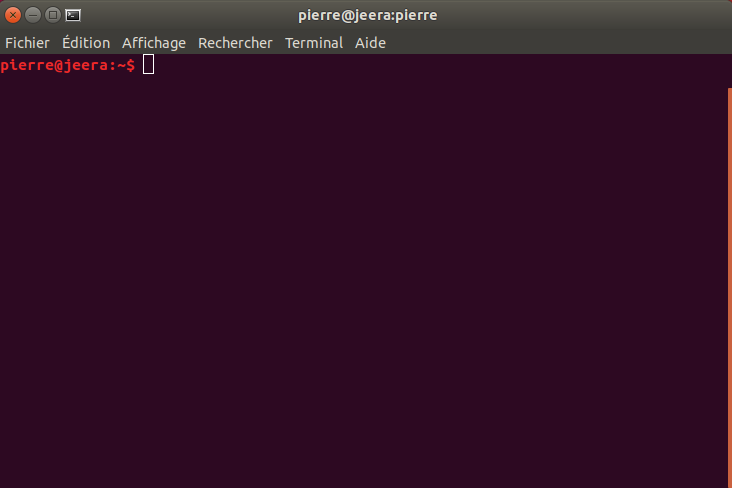
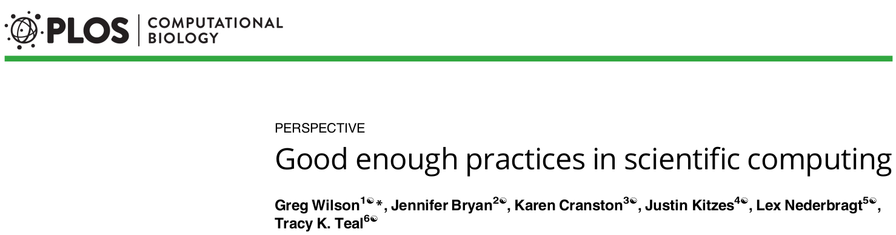
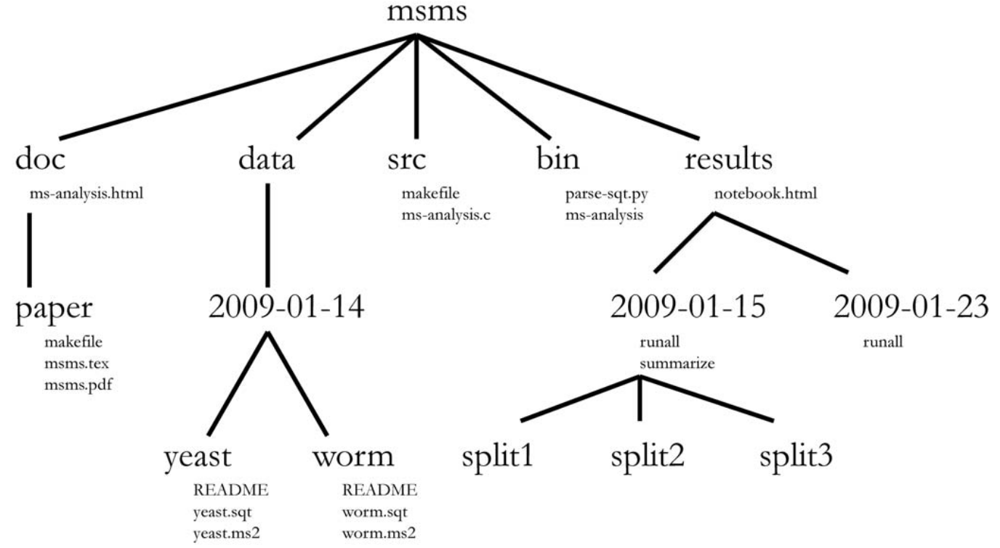

class: center, middle

# Module 1 : Unix

## DU Bii 2019

Hélène Chiapello, Pierre Poulain

.footer[
https://du-bii.github.io/module-1-Environnement-Unix/
]

---

layout: true
name: title
class: center, middle

.footer[
DU Bii 2019
]

---

layout: true
name: content

.footer[
DU Bii 2019
]

---

template: title

# Premiers pas Unix

---

class: center

# Le shell

--

 
 

## Une interface de commandes

# .fas.fa-user[] / .fas.fa-desktop[]

---

template: content

##  Une **interface** de commandes

--

---

template: content

##  Une **interface** de commandes

## À vous !
.callout.callout-success[
Prises de contact avec les machines de l'université :

1. Obtenez votre *login* et votre mot de passe.
1. Ouvrez votre session.
1. Explorez l'interface graphique.
1. Lancez un *shell* via l'application terminal.
1. Changez votre mot de passe avec la commande `yppasswd` (avec 2 `p` et 2 `s`).
1. Fermez votre session puis reconnectez-vous.
]

---

template: content

##  Une interface de **commandes**

Activité préparatoire sur [DataCamp](https://www.datacamp.com/courses/introduction-to-shell-for-data-science)

--

.right[
.fas.fa-comments[]
Activité [WooClap](www.wooclap.com/DUBII)
]

---
template: title

# Bonnes pratiques pour organiser vos projets (bioinfo)

---
template: content

## Bonnes pratiques pour organiser vos projets

Deux références :

.ref[
Noble, PLoS Comput Biol, 2009, DOI [10.1371/journal.pcbi.1000424](https://journals.plos.org/ploscompbiol/article?id=10.1371/journal.pcbi.1000424)
]

 

.ref[
Wilson, PLoS Comput Biol, 2017, DOI [10.1371/journal.pcbi.1005510](https://journals.plos.org/ploscompbiol/article?id=10.1371/journal.pcbi.1005510)
]

---
template: content

## Bonnes pratiques pour organiser vos projets

.center[

]

.right.ref[
Noble, PLoS Comput Biol, 2009, DOI [10.1371/journal.pcbi.1000424](https://journals.plos.org/ploscompbiol/article?id=10.1371/journal.pcbi.1000424)
]

---
template: content

## Bonnes pratiques pour organiser vos projets

Nom de fichiers et répertoires & format de date :

.center[

]

.right.ref[
 [XKCD, ISO 8601](https://xkcd.com/1179/)
]

---
template: content

## Bonnes pratiques pour organiser vos projets

.center[

]

.right.ref[
Wilson, PLoS Comput Biol, 2017, DOI [10.1371/journal.pcbi.1005510](https://journals.plos.org/ploscompbiol/article?id=10.1371/journal.pcbi.1005510)
]

---
template: title

# Retour à la pratique

.callout.callout-success[
[Tutoriel](https://du-bii.github.io/module-1-Environnement-Unix/seance1/tutorial/)
]
