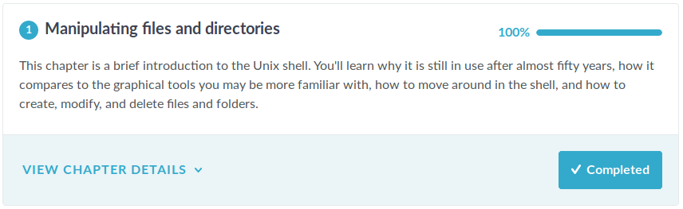

class: center, middle

# Module 1 : Unix

## DU Bii 2019

Hélène Chiapello, Pierre Poulain

.footer[
https://du-bii.github.io/module-1-Environnement-Unix/
]

---

layout: true
name: title
class: center, middle

.footer[
DU Bii 2019
]

---

layout: true
name: content

.footer[
DU Bii 2019
]

---

template: title

# Premiers pas Unix

---

class: center

# Le *shell*

--

 
 

## Une interface de commandes

# .fas.fa-user[] / .fas.fa-desktop[]

---

template: content

##  Une **interface** de commandes

--

---

template: content

##  Une **interface** de commandes

## À vous !

.callout.callout-success[
Prise de contact avec les machines de l'université :

1. Obtenez votre *login* et votre mot de passe.
1. Ouvrez votre session.
1. Lancez un *shell* via l'application terminal.
1. Changez votre mot de passe avec la commande `yppasswd` (avec 2 `p` et 2 `s`).
1. Fermez votre session puis reconnectez-vous.
1. Lancez un navigateur internet et ouvrez la page <https://huit.re/dubii-m1>
]

---

template: content

##  Une interface de **commandes**

Activité préparatoire sur [DataCamp](https://www.datacamp.com/courses/introduction-to-shell-for-data-science)

--

.right[
.fas.fa-comments[]
Activité [WooClap](https://www.wooclap.com/DUBII)
]

---
template: title

# Tutoriel 1

.callout.callout-success[
[Tutoriel 1](https://du-bii.github.io/module-1-Environnement-Unix/seance1/tutorial_1/)
]
