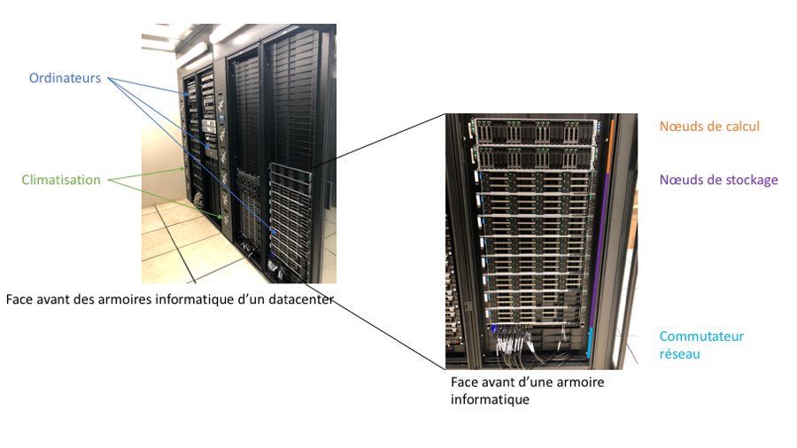
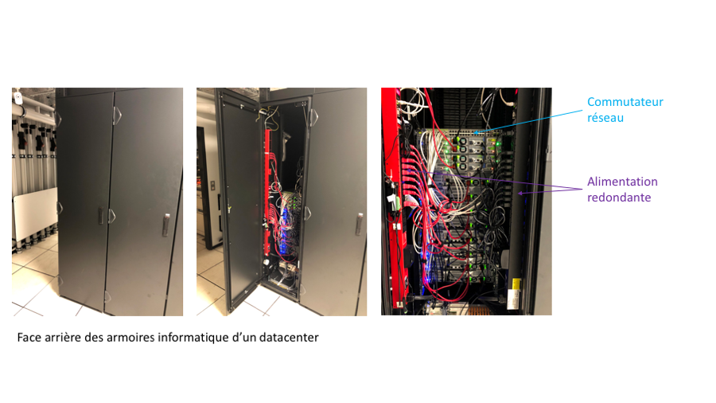

class: center, middle

# Utilisation de la ferme de calcul de l'IFB

## DU Bii 2019

Jacques van Helden (jacques.van-helden@univ-amu.fr) 
Julien Seiler (julien.seiler@igbmc.fr)

.footer[
https://github.com/DU-Bii/module-1-Environnement-Unix
]

---

layout: true
name: title
class: middle

.footer[
DU Bii 2019
]

---

layout: true
name: content

.footer[
DU Bii 2019
]

---

template: content

# De quoi allons-nous parler aujourd'hui ?

* Qu'est-ce qu'une ferme de calcul et à quoi cela sert-il ?
* Se connecter à distance
* Le gestionnaire de ressources SLURM
* Utiliser "module" pour charger des outils
* Utiliser "conda" pour charger des bouquets thématiques d'outils

---

template: title

# Qu'est-ce qu'une ferme de calcul et à quoi cela sert-il ?

---

template: content

# Comment fonctionne un ordinateur ?

## un ou plusieurs processeurs .fas.fa-microchip[]

Il s'agit de puces électroniques qui exécutent les instructions élémentaires des différents programmes

--

## de la mémoire vive .fas.fa-memory[]

La mémoire est utilisée par le processeur pour traiter les données (un ordinateur classique dispose généralement de 4 ou 8 Go de mémoire)

--

## de l'espace de stockage .fas.fa-hdd[]

Cet espace permet de conserver des grandes quantités de données de façon permanente (un ordinateur individuel dispose en moyenne d'un To d'espace de stockage)

---

# Comment fonctionne un ordinateur ?

## .fas.fa-microchip[] .fas.fa-memory[] .fas.fa-hdd[]

Ces ressources permettent d'effectuer un grand nombre de tâches comme **surfer sur Internet**, **utiliser un tableur** ou **un logiciel de traitement de texte**. Certains ordinateurs suffisamment puissants peuvent même être utilisés pour effectuer des **traitements vidéos** ou **jouer à des jeux en 3D**.

--

## .fas.fa-microchip[] .fas.fa-microchip[] .fas.fa-microchip[] .fas.fa-microchip[]  .fas.fa-memory[] .fas.fa-memory[] .fas.fa-memory[]  .fas.fa-hdd[] .fas.fa-hdd[]

Cependant, les ordinateurs individuels ne sont généralement pas assez puissant pour lancer des **programmes d'analyses de données massives**. En effet, ces programmes ont besoin d'un grand nombre de processeurs (parfois plusieurs dizaines ou centaines), d'énormément de mémoire vive (une centaine de Go pour certains programmes) et de gros espaces de stockage de données (plusieurs To).  

--

.callout.callout-success[L'analyse de données massives nécessite l'utilisation d'une ferme de calcul]

---

# Comment fonctionne une ferme de calcul ?

Une ferme de calcul est **un ensemble d'ordinateurs très puissants** appelés supercalculateurs mis **en réseau** afin d'être accessible aux scientifiques pour lancer des programmes d'analyse de données.

Cet ensemble d'ordinateurs constitue une réserve de processeurs et de mémoire vive.

Quelques exemples de fermes de calcul :
.pure-table.pure-table-bordered.smaller-font[
Ferme de calcul | Processeurs (coeurs physiques) | Mémoire vive (en Go) | Espace de stockage (en To) | Modalité d'accès
--- | --- | --- | --- | ---
IFB Core (Orsay - IDRIS) | 2 000 | 20 008 | 400 | Ouvert à tous les biologistes académiques
GENOTOUL (Toulouse) | 3 064 | 34 304 | 3 000 | ???
CINES OCCIGEN | 85 824 | 202 000 | 8 000 | Sur appel à projet
]

---

# A quoi ressemble une ferme de calcul ?

Une ferme de calcul est généralement installée dans un “datacenter”. C'est une salle spéciale permettant de faire fonctionner les ordinateurs dans des conditions optimales de température, d'humidité et de sécurité.

.center[]

---

# Le datacenter de l'IGBMC

.center[]

---

# Le datacenter de l'IGBMC

.center[]

---

# Comment accéder à une ferme de calcul ?

Seuls les ingénieurs en charge de la maintenance de la ferme de calcul sont habilités à entrer dans le datacenter. Ainsi, **il n'est pas possible d'utiliser directement ces ordinateurs à l'aide d'un clavier et d'un écran**. Il est nécessaire de s'y connecter au travers d'un **réseau informatique** comme Internet par exemple.

Afin de s'assurer que les ressources (ordinateurs, processeurs, mémoire) soient convenablement réparties entre leurs utilisateurs en fonction de leurs besoins, un logiciel permet aux utilisateurs de **réserver et d'accéder aux ressources**. C'est au travers de ce logiciel que l'on peut accéder à un ou plusieurs ordinateurs de la ferme de calcul.
