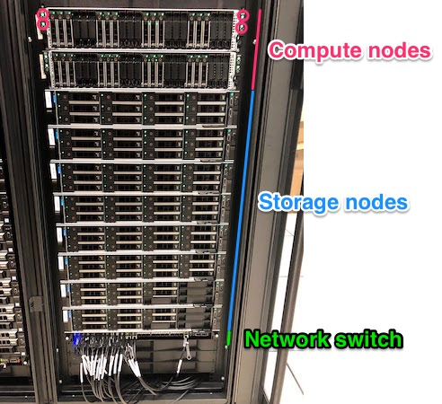

class: center, middle

# IFB High Performance computing usage

## DU-Bii 2019

Julien Seiler (julien.seiler@igbmc.fr)<br/>
Jacques van Helden (jacques.van-helden@univ-amu.fr)

.footer[
https://du-bii.github.io/module-1-Environnement-Unix/
]

---

layout: true
name: title
class: middle

.footer[
[DU-Bii 2019](https://du-bii.github.io/accueil/)
]

---

layout: true
name: submit-options

# Submitting a job

## Common options

---

layout: true
name: exercise-dependency

# Job control

## Exercise

Imagine we start the following pipeline:
```
$ sbatch data_download.sh
Submitted batch job 1
$ sbatch --dependency=afterok:1 data_analysis.sh
Submitted batch job 2
```

---

layout: true
name: content

.footer[
[DU-Bii 2019](https://du-bii.github.io/accueil/)
]


---

template: content

# What are we going to talk about today?

* What is an ___HPC cluster___ and what is it used for ?
* How to connect to the ___IFB___ core cluster
* The ___SLURM___ Batch system
* Use "module" to load tools

---
template: content

# What are we going to talk about today?

* What is an ___HPC cluster___ (1) and what is it used for ?
* How to connect to the ___IFB___ (2) core cluster
* The ___SLURM___ (3) Batch system
* Use "module" to load tools

.footnote[
1. High-Performance Computing 
2. Institut Français de Bioinformatique
3. Simple Linux Utility for Resource Management
]
---


template: title

# What is HPC cluster and what is it used for ?

---

template: content

# How does a computer work ?

## one or more chips .fas.fa-microchip[]

A chip (or microprocessor) is responsible for executing elementary instructions requested by the software

--

## RAM (Random access memory) .fas.fa-memory[]

RAM is used by the chip to process data (a personal computer has between 4 to 8 GB of RAM)

--

## storage space .fas.fa-hdd[]

The storage space is used to keep huge amount of data in a more permanent way (a personal computer has an average of one TB of storage space)

---

# Bit or Byte ?

A bit is **a single** binary data: 0 or 1

A byte is made of **8 bits**: 1 byte (B) = 8 bits (b)

1 Terabyte (T**B**) = 1000 Gigabytes (G**B**) = 1e+6 Megabytes (**MB**) = 8 000 000 Megabits (M**b**)

---

# How does a computer work ?

## .fas.fa-microchip[] .fas.fa-memory[] .fas.fa-hdd[]

A personal computer has enough resources to let you run a lot of tasks like **browsing the Internet**, **work with spreadsheet** or **text processing software**. Some personal computers have even enough resources to enable **video processing** or **playing 3D videogames**.

--

## .fas.fa-microchip[] .fas.fa-microchip[] .fas.fa-microchip[] .fas.fa-microchip[]  .fas.fa-memory[] .fas.fa-memory[] .fas.fa-memory[]  .fas.fa-hdd[] .fas.fa-hdd[]

However, personal computer are not powerful enough to run **massive data analysis programs**. Indeed, these programs need a huge number of processing units (10 to 100 CPUs), huge amounts of RAM (100 GB for some programs) and large data storage capabilities  (several TB for a single research project).<br/><br/>

--

.callout.callout-success[Massive data analysis requires a *High Performance Computing (HPC) cluster*.]

---

# What is a HPC cluster?

A set of big computers connected together that can be considered as a single system.

A HPC cluster is usually located in a **data center**, *i.e.* a dedicated room providing all conditions required by HPC in terms of temperature, humidity, power supply and physical security.

.center[]

---

# A data center contains racks

.center[]

---

# Each rack can hold several computers

.center[]

---

# Rear view

.center[]

---

# More hardware concerns

.center[
## A node = a physical machine

Each physical machine has one **motherboard**

.center[]

This motherboard has 2 **sockets** to plug **microprocessors**.<br/>
A microprocessor is a **multicore** technology.
]
---

class: center

# Do not confuse Microprocessor and Core

A microprocessor is a **physical chip**.


Core = CPU = Central Processing **Unit**

15 to 20 years ago: 1 microprocessor = 1 core<br/><br/>

.callout.callout-danger[THIS IS NOT TRUE ANYMORE]

---

class: center

# Do not confuse Microprocessor and Core

On the IFB HPC Cluster:

1 node = 2 sockets = 2 microprocessors = 2 x 14 cores = 28 CPU<br/><br/>

.callout.callout-info[A HPC cluster can be seen has a pool of cores.]

---

# Some HPC clusters in France

.pure-table.pure-table-bordered.smaller-font[
Cluster | Data center location | Cores | RAM (in GB) | Storage space (en TB) | Access modality
--- | --- | --- | --- | --- | ---
IFB Core | IDRIS - Orsay | 2 000 | 20 008 | 400 | Open to all academic biologists and bioinformaticians
GENOTOUL | Toulouse | 3 064 | 34 304 | 3 000 | Open to INRA/Occitane region (overloaded currently)
CINES OCCIGEN | Montpellier | 85 824 | 202 000 | 8 000 | On call for projects
]

---

# How to access a HPC cluster?

Only the engineers in charge of maintenance of the cluster are authorized to enter the data center. Thus, **it is not possible to use these computers directly using a keyboard and a screen**. It is necessary to connect to it through a **computer network** such as the Internet.

To ensure that resources (nodes, cores, memory) are properly distributed among their users according to their needs, a software called a **Batch system** allows users to **book and access resources**. It is through this software that you can access one or more computers on the HPC cluster.

---

# What do I need to know to use a HPC cluster ?

## Basic Unix

There is no graphical user interface on a HPC cluster

## How to connect to a remote host through the network

Your personal computer need to get connected to the cluster !

## How to use a Batch system

One connected to the cluster, you need to learn how to submit compute job

---

template: title

# Connect to a remote host through the network

---

template: content

# What is a shell?

A shell is a **software interface** that allows a user to interact with a computer or server by executing different commands that will return information.

```bash
$ pwd          # print working directory
/shared/home/jseiler
$ ls           # list the files found in the current directory
projets     toto.txt     script.sh
$ cd projets   # change the working directory to the folder named "projets"
$ ls           # list files present in the new working directory
mission-to-mars      rama-II       time-travel
```

The shell allows you to dialog with a local workstation: this assumes that you are physically present in the same room as the machine.

---

# SSH: the remote shell

To interact with a remote computer you need:
* A communication support: computer **network** like Internet
* A communication protocol: **SSH**

SSH (for Secure SHell) is the most commonly used protocol for establishing dialogue and launching commands on a remote machine.

---

# SSH: the remote shell

SSH needs two parameters to run:
* The name or IP of the remote computer
* A user credential (username + password)

Under Linux or Mac, you can use SSH from the Terminal/Console application:

```bash
$ ssh <username>@<remote-host-name>
```

.callout.callout-info[
Under Windows, you can use a Terminal applications like PuTTY or MobaXterm.
]

.callout.callout-warning[
Attention, it is not possible to communicate with **each and every** computer through the SSH protocol. The remote computer **must have** a running SSH service.
]

---

# SSH: the remote shell

## Connect to the IFB HPC cluster

* Remote computer: core.cluster.france-bioinformatique.fr
* User credential: *you received it by email*

Use your Terminal application to connect the cluster:
```
$ ssh <username>@core.cluster.france-bioinformatique.fr
```
*Replace `<username>` with your username.*

You will then be asked for your password (no character are printed while on type in your password).

You are now connected to the IFB cluster ***submission node***.

Type `exit` to close the connection.

---

# SSH: the remote shell

## Copy data remotely

SSH allows you to copy data to or from a remote computer with the `scp` command.

The syntax to copy data from your personal computer to a remote host is:
```bash
$ scp /path/to/local/file <username>@<remote-host>:/remote/destination/path
```
*Replace `<username>` with your username.*

You can also copy data from a remote host to your personal computer:
```bash
$ scp <username>@<remote-host>:/remote/path /local/path
```
*Replace `<username>` with your username.*

---

# SSH: the remote shell

## Exercise

1. Connect to `core.cluster.france-bioinformatique.fr` and retrieve the full name of the pdf document located in `/shared/space2/du-bii/data/cluster/`
2. Copy this PDF document to your local computer

---

# SSH: the remote shell

## Exercise

1. Connect to `core.cluster.france-bioinformatique.fr` and retrieve the full name of the pdf document located in `/shared/space2/du-bii/data/cluster/`

--

```bash
local $ ssh seiler@core.cluster.france-bioinformatique.fr
cluster $ ls /shared/space2/du-bii/data/cluster/
slides.pdf
```
*Replace `seilerj` with your own username (I'm not sharing my password)*

--

2. Copy this PDF document to your local computer

```bash
cluster $ exit  # quit the cluster and get back to your local shell
local $ scp seilerj@core.cluster.france-bioinformatique.fr:/shared/space2/du-bii/data/cluster/slides.pdf .
```
*Replace `seilerj` with your own username (still not sharing my password)*

---

template: title

# The SLURM Batch system

---

template: content

# What is a Batch system

The IFB cluster uses a Batch system software for managing and allocating resources.

--

There are different batch systems, e.g.:

* Sun Grid Engine (SGE)
* Load Sharing Facility (LSF)
* TORQue
* SLURM

--

.center.callout.callout-success[**The IFB cluster is based on SLURM.**]

---

# SLURM components

A cluster based on SLURM is composed of several type of nodes:

--

* **Submission node**: this is the node where user connect to use the cluster (core.cluster.france-bioinformatique)

.center.callout.callout-warning[You should NEVER run programs on the submission node]

--

* **Compute nodes**: these are the nodes where you jobs get executed (lots of CPU and RAM)

--

* **Administrative node**: this is the node dedicated to the cluster management (you should not care about them)

--

* **Storage nodes**: these nodes are used to made your data available all over the cluster

---

# SLURM components

.center[]

---

# Basic SLURM concepts

**Account**: A logical group of users

Your default account is `du_bii_2019`

--

**Ressources**: nodes, CPUs, memory

--

**Partition**: logical group of nodes

They are two partitions on the IFB cluster:
* `fast`: limited to 1 day - 68 nodes available
* `long`: limited to 10 days - 31 nodes available

The default partition is `fast`.

---

# Basic SLURM concepts

## Job

**User's point of view**: a calculation or data analysis

It could be a single program or a full pipeline (a succession of programs).

**Slurm's point of view**: an allocation of resources

--

## Job steps

The processes that actually do the real work

---

# Submitting a job

They are two commands to let you submit a job to the cluster:

.left-column[
## `srun`
**Run job interactively**

* Starts immediately after you execute the `srun` command
* Outputs are returned to the terminal
* You have to wait until the job has terminated before starting a new job
* Works with **ANY command**

```
$ srun hostname
```
]

--

.right-column[
## `sbatch`
**Batch job submission**

* Starts when resources are available
* Only returns the job id
* Outputs are sent to file(s)
* Works **ONLY with shell scripts**

```
$ sbatch my_script.sh
```
]

---

template: submit-options

### CPUs  *(1 CPU = 1 core)*

`--nodes/-N`: number of nodes (default is 1)

`--ntasks/-n`: number of tasks (default is 1)

`—cpus-per-task/-c`: number of CPU per task (default is 1)

--

**Exercises**<br/>
```
$ srun hostname
cpu-node-1
$ srun --ntasks 2 hostname
cpu-node-1
cpu-node-1
$ srun --nodes 2 --ntasks 2 hostname
cpu-node-1
cpu-node-2
```

---

### Memory

`--mem`: memory for the whole job

`--mem-per-cpu`: memory per CPU

---

template: content

# Interactive job

`srun`

---
template: content

# Batch job

## What is a batch job ?

* A asynchronous action
* A job based on a script

--

.left-column[
## Use the `sbatch` command

`sbatch myscript.sh`

The script contains srun commands<br/>
Each `srun` is a job step
]

--

.right-column[
## Some `sbatch` options

`-o -e`: redirect job output/error in different file

`--mail-type BEGIN, END, FAIL`: activate email notification

`--mail-user`: who you want to notify
]

---
template: content

# Batch script rules

* Must start with shebang (#!) follow by the path of the interpreter
  * `#! /bin/bash`
  * `#! /usr/bin/python`
  * etc.

--

* Can contain slurm options just **after the shebang** but **before the script commands** → `#SBATCH`
```
#SBATCH -o <out_filename> -e <err_filename>
#SBATCH -p <partition>
#SBATCH -mem-per-cpu=<MB value>
```

---

# Demonstration

```bash
#! /bin/bash
#SBATCH -p fast
#SABTCH -o myscript.out -e myscript.err
srun sleep 30 || exit 1
echo -n "Job id is ${SLURM_JOB_ID}"
srun hostname || exit 2
exit 0
```

---

# In brief

Submit (not start) the job:
```
$ sbatch myscript.sh
```

View jobs in the cluster queue:
```
$ squeue
```

View only my jobs in the cluster queue:
```
$ squeue -u <username>
```

View only my running jobs steps:
```
$ squeue -u <username> -s
```

---

# Job control

## Cancel a job

`scancel <jobid>`: Cancel job with id `<jobid>`

`scancel -u <user>`: Cancel all jobs from user `<user>`

`scancel -n <jobname>`: Cancel all jobs with name `<jobname>`

`scancel -u <user> -p <partition> -t <state>`: Cancel all jobs from user `<user>`, in partition `<partition>`, in state `<state>`

---

# Job control

## Modify a job
<br/>
.callout.callout-warning[Only if it is pending]
<br/><br/>

`scontrol update jobid=<jobid> partition=<other_partition> account=<other_account> numcpus=<number_of_total_cpus>`<br/>

---

# Job control

## Prevent a job from starting

<br/>
.callout.callout-warning[Only if it is pending]
<br/><br/>

`scontrol hold <jobid>`

`scontrol release <jobid>`

---

# Job control

## Dependencies between jobs

Slurm lets you define dependencies between jobs in order to manage task ordering.

`sbatch --dependency=afterok:<other_jobid> <script>`<br/>
*Start this job only after <other_jobid> has finished successfully.*

`sbatch --dependency=afternotok:<other_jobid> <script>`<br/>
*Start this job only after <other_jobid> has failed.*

`sbatch --dependency=after:<other_jobid> <script>`<br/>
*Start this job only after <other_jobid> has started (control starting order)*

`sbatch --dependency=afterany:<other_jobid> <script>`<br/>
*Start this job only after <other_jobid> has finished (what ever exit code)*

---

template: exercise-dependency

**Q1: After job `1` has started, what will be the status of job `2` ?**

--

Job `2` will be in `pending` status because it is waiting for job `1` to finish successfully.

--

**Q2: How can you check the status of job `2` ?**

--

```
$ squeue -j 2
JOBID PARTITION     NAME     USER ST       TIME  NODES NODELIST(REASON)
    2      fast data_ana  jseiler PD       0:00      1 cpu-node1(Dependency)
```
---

template: exercise-dependency

We realize that we targetted the wrong data in the first job.

**Q3: How can you cancel job `1` ?**

--

```
$ scancel 1
```

--

**Q4: What will be the status of job `2` ?**

Job `2` is still `pending`.

--

```
$ squeue
JOBID PARTITION     NAME     USER ST       TIME  NODES NODELIST(REASON)
    2      fast data_ana  jseiler PD       0:00      1 cpu-node1(DependencyNeverSatisfied)
```

---

template: exercise-dependency

We have fixed the `data_download.sh` script.

**Q5: How can we restart the script and update the dependency on job `2` ?**

--

```
$ sbatch --hold data_download.sh
Submitted batch job 3
$ scontrol update jobid=2 dependency=afterok:3
$ scontrol release 3
$ squeue
JOBID PARTITION     NAME     USER ST       TIME  NODES NODELIST(REASON)
    2      fast data_ana  jseiler PD       0:00      1 cpu-node1(Dependency)
    3      fast data_dow  jseiler  R       0:33      1 cpu-node1
```

---

template: title

# Use `module` to load bioinformatics tools

---

# Why do we need to "load" tools ?

* Each tools need it environment (binaries, libraries, documentation, special variables)
* Each tools has its own dependencies. It is not possible to coexist all tools in the same environment.
* Reproducibility does matter: some user might need different versions of the same tool

At the IFB, the cluster administrators are installing all tools required by the users.<br/>
To get access to a tool, you need to **load it into your environment** using a special tool called `module`.

---

# What are availables tools ?

List all available tools:

```
$ module avail -l
biokevlar/0.6.1                                             2019/01/23 15:12:20
blast/2.6.3                                                 2019/01/23 15:12:59
blast/2.7.1                                                 2019/01/23 15:12:59
conda                                                       2018/11/20 12:25:32
dot                                                         2018/11/20 12:25:32
eacon/0.3.4                                                 2018/11/30 10:05:25
eba_chipseq/2017                                            2019/01/23 10:45:04
eba_chipseq/2018                                            2019/01/23 11:37:12
```

---

# Loading, listing, switching, unloading

`module load blast`: Load latest version of blast available on the cluster

--

`module load blast/2.6.3`: Load version 2.6.3 of blast

--

`module list`: List tools currently loaded in your environment

--

`module switch blast/2.7.1`: Replace blast currently loaded by blast version 2.7.1

--

`module unload blast`: Unload blast from your environment

--

`module purge`: Unload all tools

---

# Creating a tool collection

Load and unload a collection of tools at once.

.left-column[
## Create a collection

Load the requested tools:

```
module load blast  # The most popular tool for sequence similarity searches
module load hmmer  # Hidden Markov Models-baset motif search
```

Save the current tools in a collection

```
module save ngs
```

## View your collection list

```
module savelist
Named collection list:
 1) ngs
```
]

.right-column[
## Load a collection

```
module restore ngs
```

## Other collection commands

`module saveshow <collection>`: consult the content of a collection

`module saverm <collection>`: suppress a collection
]
