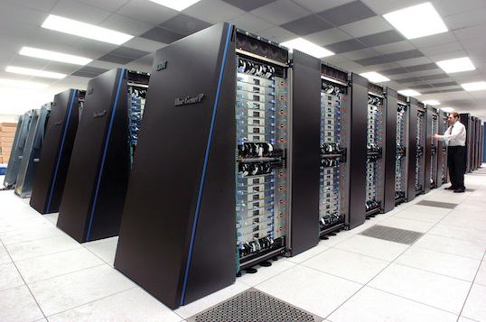
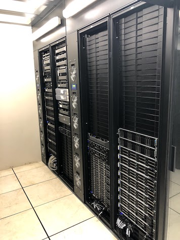
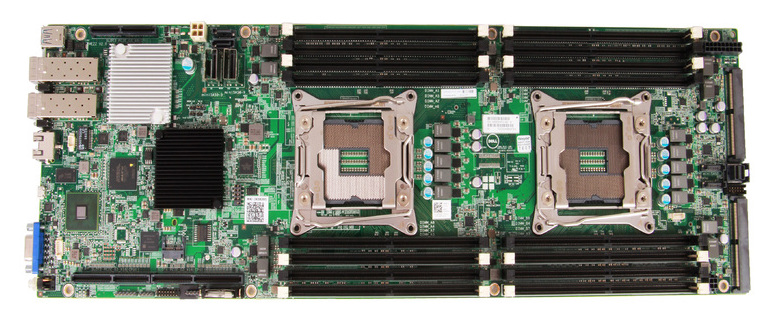
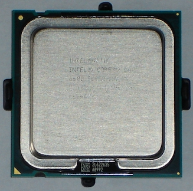

template: title

# What is an HPC cluster and what is it used for ?

---

template: content

# How does a computer work ?

## one or more chips .fas.fa-microchip[]

A chip (or microprocessor) is responsible for executing elementary instructions requested by the software

--

## RAM (Random access memory) .fas.fa-memory[]

RAM is used by the chip to process data (a personal computer has between 4 to 8 GB of RAM)

--

## storage space .fas.fa-hdd[]

The storage space is used to keep huge amount of data in a more permanent way (a personal computer has an average of one TB of storage space)

<!---
More on how CPU works : https://www.youtube.com/watch?v=FRCXF1Sak7s
-->

---

# How a program gets executed ?

Whatever the language it has been written in (C, Python, Java, etc.), in the end, a program is translated in "machine code".  The "machine code" is a set of instructions that can be executed directly by a computer processor.

.center[]

---

# How does a computer work ?

## .fas.fa-microchip[] .fas.fa-memory[] .fas.fa-hdd[]

A personal computer has enough resources to let you run a lot of tasks like **browsing the Internet**, **work with spreadsheet** or **text processing software**. Some personal computers have even enough resources to let **process videos** or **play 3D video games**.

--

## .fas.fa-microchip[] .fas.fa-microchip[] .fas.fa-microchip[] .fas.fa-microchip[]  .fas.fa-memory[] .fas.fa-memory[] .fas.fa-memory[]  .fas.fa-hdd[] .fas.fa-hdd[]

However, personal computer are not powerful enough to run **massive data analysis programs**. Indeed, these programs need a huge number of processing units (10 to 100 CPUs), huge amounts of RAM (100 GB for some programs) and large data storage capabilities  (several TB for a single research project).  

--

.callout.callout-success[Massive data analysis requires a *High Performance Computing (HPC) cluster*.]

---

# What is a HPC cluster?

A set of big computers connected together that can be considered as a single system.

A HPC cluster is usually located in a **data center**, *i.e.* a dedicated room providing all conditions required by HPC in terms of temperature, humidity, power supply and physical security.

.center[]

---

# A data center contains racks

.center[]

---

# Each rack can hold several computers

.center[]

---

# Rear view

.center[]

---

# More hardware concerns

.center[
## A node = a physical machine

Each physical machine has one **motherboard**

.center[]

This motherboard has 2 **sockets** to plug **microprocessors**. 
A microprocessor is a **multicore** technology.
]
---

class: center

# Do not get confused between Microprocessor and Core

A microprocessor is a **physical chip**.

Core = CPU = Central Processing **Unit**

15 to 20 years ago: 1 microprocessor = 1 core  

.callout.callout-danger[THIS IS NOT TRUE ANYMORE]

---

class: center

# Do not confuse Microprocessor and Core

On the [IFB](http://www.france-bioinformatique.fr) HPC Cluster:

1 node = 2 sockets = 2 microprocessors = 2 x 14 cores = 28 x 2 threads = 56 "CPU"  

.callout.callout-info[A HPC cluster can be seen as a pool of cores.]

---

# HPC clusters in France by IFB

.pure-table.pure-table-bordered.smaller-font[
Cluster | Data center location | Cores | RAM (GB) | Storage (TB) | Access modality
--- | --- | --- | --- | --- | ---
IFB Core | IDRIS - Orsay | 5 042 | 26 542 | 400* | Open to all academic biologists and bioinformaticians
GENOTOUL | Toulouse | 6 128 | 34 304 | 3 000 | Open to all academics with priority to INRA/Occitane region (currently overloaded)
ABiMS | Roscoff | 1 928 | 10 600 | 2 000  | Open to all academic biologists and bioinformaticians
GenOuest | Rennes | 1 824 | 7 500 | 2 300 | Open to all academic biologists and bioinformaticians
Migale | Jouy en Josas | 1 084 | 7 000 | 350 | Open to all academic biologists and bioinformaticians
BiRD | Nantes | 560 | 4 000 | 500 | Open to all academic biologists and bioinformaticians
]
_*2400TB in spring 2020_
