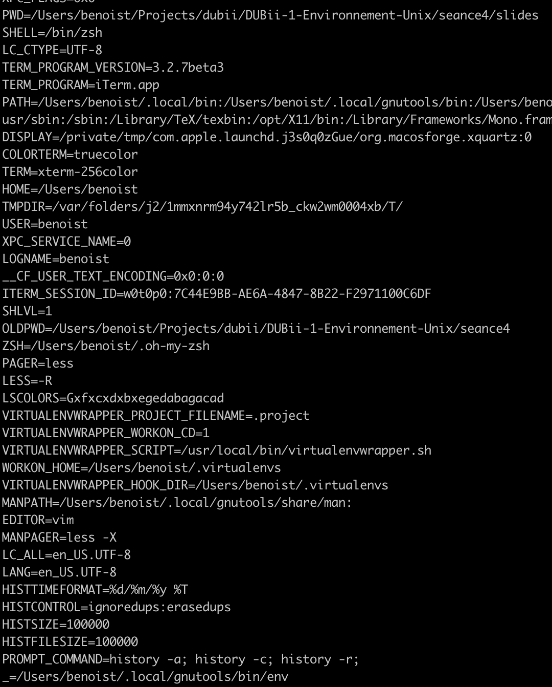
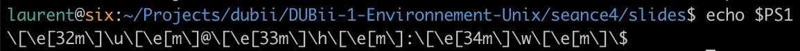
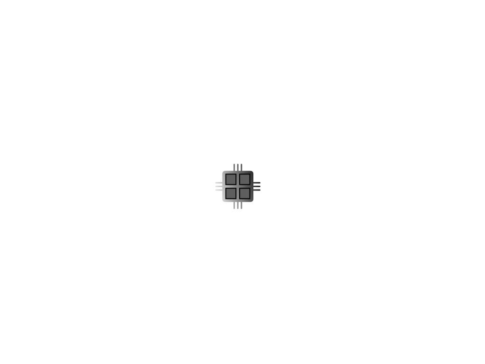
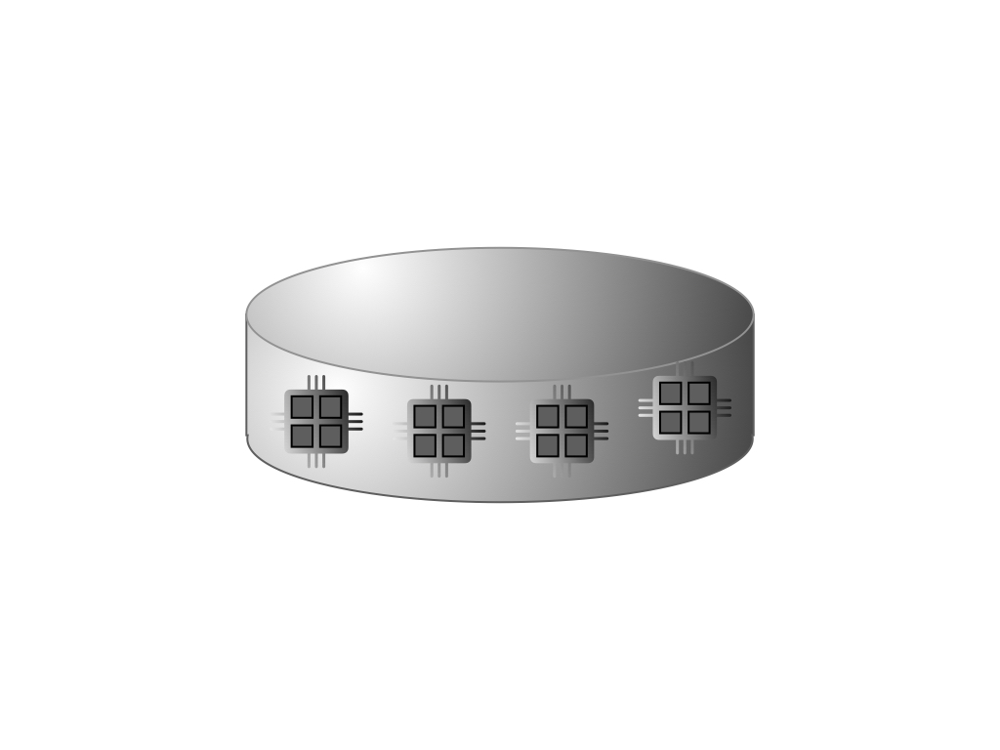

class: center, middle

# Unix 4: automatisation

## DU-Bii 2019

Benoist Laurent (benoist.laurent@gmail.com)<br/>
Hélène Chiapello (helene.chiapello@inra.fr)<br/>
Pierre Poulain (pierre.poulain@univ-paris-diderot.fr)

.footer[
https://du-bii.github.io/module-1-Environnement-Unix/
]


---

# Agenda

1. Environment Variables
2. Scripting
3. Distributed Computing

<!-- ---------------------------------------------------------------------- -->

---

class: center

# Environment Variables



---

# Environment Variables : `PS1`

`PS1` is the environment variable that controls what your prompt looks like

```bash
laurent@six:~/Projects/dubii/DUBii-1-Environnement-Unix/seance4/slides$
```

---

# Environment Variables : `PS1`

`PS1` is the environment variable that controls what your prompt looks like

```bash
laurent@six:~/Projects/dubii/DUBii-1-Environnement-Unix/seance4/slides$ echo $PS1
\u@\h:\w$
```

--
- `\u`: user name
- `\h`: host name
- `\w`: complete path of current working directory

--


- `\W`: the basename of the current working directory
- `\t`: current time in 24-hour format
- `\d`: the date in "Weekday Month Date"
- [...]

---

# Environment Variables : `PS1`

You can even use colors in your prompt:

.center[]

---

# \w or \W?

.center[ ]

---

# \w or \W?: for me, it's \w with \n!

<br/><br/>
.center[]

<br/><br/>
Try yourself: http://ezprompt.net


<!-- ---------------------------------------------------------------------- -->

---

class: center

# Shell Programming


<!-- ---------------------------------------------------------------------- -->

---

class: center

# Distributed Computing


---

# A Computer's Architecture

## A CPU (core)

.center[]

---

# A Computer's Architecture

## A Processor

.center[]

---

# A Computer's Architecture

## A Computer

.center[]

---

# A Computer's Architecture

## A Cluster

.center[]
